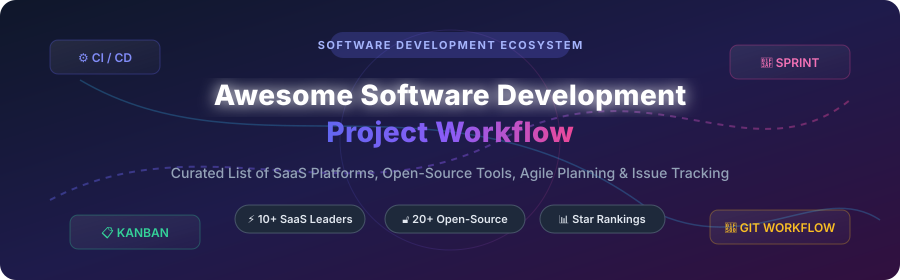

  
  
  
  

# 🚀 Awesome Software Development Project Workflow

> **A curated collection of premier SaaS platforms, open-source tools, Agile planning suites, sprint boards, and DevOps issue tracking solutions for modern engineering teams.**

*Focusing on Agile planning, Scrum & Kanban workflows, issue tracking, CI/CD integrations, and enterprise development sovereignty.*

**Last updated: October 2026**

---

## 📌 Table of Contents

- [☁️ SaaS / Hosted Platforms](#%EF%B8%8F-saas--hosted-platforms)
- [🔓 Open-Source GitHub Projects](#-open-source-github-projects)
- [🛠️ Frameworks & Integration Stacks](#%EF%B8%8F-frameworks--integration-stacks)
- [🤝 How to Contribute](#-how-to-contribute)
- [⚠️ Disclaimer](#%EF%B8%8F-disclaimer)
- [💖 Support](#-support)
- [📈 Star History](#-star-history)

---

## ☁️ SaaS / Hosted Platforms

📊 **Market Insights**: The global **Software Development Project Management & DevOps Workflow Market** is estimated at **$18.5 Billion in 2026** (projected to grow at a ~16.8% CAGR). The sector is **moderately fragmented**, featuring an enterprise oligopoly (Microsoft GitHub/Azure DevOps, Atlassian Jira, GitLab) alongside fast-growing specialized challengers (Linear, ClickUp, Shortcut).

| Product | Description | Specific Starting Price | Free Tier / Trial Limit | Company Valuation / Revenue |
| :--- | :--- | :--- | :--- | :--- |
| **[GitHub Enterprise](https://github.com/enterprise)** | Integrated development platform — issues, projects, Actions CI/CD, and Copilot AI. | **$4.00** / user / mo *(Team tier)* | **Forever Free** (Unlimited users, 2,000 CI/CD mins/mo, 500MB storage) | **~$3.1 Trillion** *(Microsoft)* |
| **[Azure DevOps](https://azure.microsoft.com/en-us/products/devops)** | Microsoft's integrated DevOps suite — Boards, Repos, Pipelines, and Test Plans. | **$6.00** / user / mo *(Basic tier)* | **Forever Free** (First 5 users free, 1,800 free CI/CD parallel job mins/mo) | **~$3.1 Trillion** *(Microsoft)* |
| **[AWS CodeStar](https://aws.amazon.com/codestar/)** | Unified AWS development service — project templates, CI/CD, and collaboration. | **$1.00** / active pipeline / mo | **Forever Free** (1 active pipeline free/mo, 1,000 build mins/mo on CodeBuild) | **~$2.2 Trillion** *(Amazon)* |
| **[Targetprocess](https://www.apptio.com/products/targetprocess/)** | Enterprise Agile planning — portfolio management, SAFe support, and customizable workflows. | **$20.00** / user / mo | **30-Day Free Trial** (Up to 1,000 work entities) | **~$200 Billion** *(IBM / Apptio)* |
| **[Jira Software](https://www.atlassian.com/software/jira)** | The industry reference for Agile software development — Scrum/Kanban boards, backlog grooming, and epics. | **$8.15** / user / mo *(Standard tier)* | **Forever Free** (Up to 10 users, 2GB storage, community support) | **~$45 Billion** *(Atlassian)* |
| **[Bitbucket](https://bitbucket.org/)** | Atlassian's Git code management with deep Jira integration, pull requests, and built-in CI/CD. | **$3.00** / user / mo *(Standard tier)* | **Forever Free** (Up to 5 users, 50 build mins/mo, 10GB LFS storage) | **~$45 Billion** *(Atlassian)* |
| **[GitLab](https://about.gitlab.com/)** | Complete DevOps platform — SCM, CI/CD pipelines, security scanning, and issue tracking. | **$29.00** / user / mo *(Premium tier)* | **Forever Free** (Up to 5 users, 400 compute mins/mo, 5GB storage) | **~$9.0 Billion** *(GitLab Inc.)* |
| **[ClickUp](https://clickup.com/)** | All-in-one productivity suite — tasks, docs, whiteboards, goals, and AI assistant. | **$7.00** / user / mo *(Unlimited tier)* | **Forever Free** (Unlimited users, 100MB storage limit) | **~$4.0 Billion** *(ClickUp)* |
| **[Linear](https://linear.app/)** | Modern, high-speed issue tracker — keyboard-driven, stream-based sprint management for product teams. | **$8.00** / user / mo *(Standard tier)* | **Forever Free** (Unlimited users, up to 250 active issues) | **~$500 Million** *(Linear)* |
| **[Shortcut](https://shortcut.com/)** | Built specifically for software teams — stories, epics, iterations, and product roadmaps. | **$8.50** / user / mo *(Team tier)* | **Forever Free** (Up to 10 users, full core feature access) | **~$200 Million** *(Shortcut)* |

---

## 🔓 Open-Source GitHub Projects

Sorted by GitHub community popularity (stargazers count descending):

1. ⚡ **[AppFlowy](https://github.com/AppFlowy-IO/AppFlowy)**   
   **Open-source Notion alternative** built with Flutter and Rust. Features offline-first privacy, customizable task boards, kanban views, and extensible databases.

2. 🎨 **[AFFiNE](https://github.com/toeverything/AFFiNE)**   
   **Hyper-hybrid workspace platform** merging docs, whiteboards, and multi-dimensional project databases for modern engineering teams.

3. 📊 **[NocoDB](https://github.com/nocodb/nocodb)**   
   **Open-source Airtable alternative** that transforms any SQL database into a smart spreadsheet & workflow management interface.

4. ✈️ **[Plane](https://github.com/makeplane/plane)**   
   **Modern AI-native open-source alternative to Jira & Linear**. Features Work Items, Cycles (sprints with burn-down charts), Modules, Pages (wiki with AI), and five view layouts (List, Board, Spreadsheet, Gantt, Calendar).

5. ☕ **[Gitea](https://github.com/go-gitea/gitea)**   
   **Lightweight, fast Git service written in Go**. Includes issue tracking, code reviews, pull requests, wikis, and built-in Actions-style CI/CD pipelines.

6. 📝 **[Outline](https://github.com/outline/outline)**   
   **Fast, collaborative team knowledge base and documentation workspace** built specifically for software teams and product specifications.

7. 📌 **[Focalboard](https://github.com/mattermost-community/focalboard)**   
   **Self-hosted alternative to Trello, Notion, and Asana** maintained by the Mattermost community. Kanban boards, table, and gallery views.

8. 🦊 **[GitLab Community Edition](https://github.com/gitlabhq/gitlabhq)**   
   **Leading open-source DevOps platform core**. Complete SCM with CI/CD pipelines, issue tracking, and project management.

9. ⏱️ **[Super Productivity](https://github.com/johannesjo/super-productivity)**   
   **Advanced developer task manager & time tracker** with direct integrations for Jira, GitHub, and GitLab issues.

10. 📋 **[Wekan](https://github.com/wekan/wekan)**   
    **Open-source Trello-like kanban board**. Features real-time collaboration, swimlanes, card dependencies, and granular user roles.

11. 📈 **[OpenProject](https://github.com/opf/openproject)**   
    **Comprehensive open-source project management suite**. Work Packages, interactive Gantt charts, Scrum/Kanban boards, time tracking, cost management, and parallel Jira migration tools.

12. 🚀 **[OneDev](https://github.com/theonedev/onedev)**   
    **All-in-one DevOps platform** with Git SCM, visual CI/CD pipeline generator, and issue tracking packaged into a single Java binary.

13. 🎯 **[Leantime](https://github.com/Leantime/leantime)**   
    **Accessibility-focused project management platform** designed with features tailored for neurodiverse teams (ADHD, dyslexia), Kanban, Gantt, and goal tracking.

14. 🧱 **[Kanboard](https://github.com/kanboard/kanboard)**   
    **Minimalist visual task board**. Focuses on drag-and-drop kanban simplicity, swimlanes, and zero-overhead performance.

15. 💻 **[Taskwarrior](https://github.com/GothenburgBitFactory/taskwarrior)**   
    **Flexible, fast command-line TODO manager** for terminal power users and developer automation.

16. 🔴 **[Redmine](https://github.com/redmine/redmine)**   
    **Classic open-source issue tracking system**. Flexible role-based access control, Gantt charts, project wikis, and extensive plugin ecosystem.

17. 🔄 **[Vikunja](https://github.com/go-vikunja/vikunja)**   
    **Self-hosted task management system** featuring hierarchical subtasks, smart recurring deadlines, Gantt charts, and Telegram bot integration.

18. 🛡️ **[Taiga](https://github.com/kaleidos-ventures/taiga-back)**   
    **Focused Agile project management** tailored for Scrum sprint backlogs and Kanban boards.

19. 🎨 **[4ga Boards](https://github.com/RARgames/4gaBoards)**   
    **Minimalist real-time kanban boards** with dark mode, collapsible lists, and simple Docker deployment.

20. 🍊 **[Orangescrum](https://github.com/Orangescrum/opensource-community-edition)**   
    **Free self-hosted project management** with task tracking, time logging, checklists, and custom statuses.

---

## 🛠️ Frameworks & Integration Stacks

**Building Custom Development Workflow Stacks**:
- Combine **Plane** or **Linear** for modern issue tracking with sprint cycles.
- Utilize **OpenProject** for comprehensive Gantt charts, resource allocation, and documentation.
- Deploy **GitLab CE** or **Gitea** for tight SCM and built-in CI/CD pipelines.
- Integrate **Super Productivity** or **Taskwarrior** for local developer task automation.

---

## 🤝 How to Contribute

1. Fork the repository.
2. Add or update entries in `README.md` following the established structure.
3. Ensure open-source entries include valid GitHub repository links.
4. Submit a Pull Request with a short summary of changes.

---

## ⚠️ Disclaimer

- This is a community-curated list — not exhaustive and not an endorsement.
- Evaluate security, access controls, and data protection requirements before deploying self-hosted solutions.

---

## 💖 Support

Thank you for exploring **Awesome-Software-Development-Project-Workflow**! If you find this curated list helpful, please consider supporting the repository:

- 🌟 **Star** this repository to show your appreciation and boost visibility.
- 🍴 **Fork** and contribute additions or updates to help keep the list current.
- 📢 **Share** it with fellow software engineers, product managers, and team leads.
- ☕ **Buy me a coffee / Sponsor**: Support ongoing maintenance via the [GitHub Sponsor Dashboard](https://github.com/sponsors/ishandutta2007).

Your support is greatly appreciated!

---

## 📈 Star History

---

**Made for software teams, product managers, and organizations seeking development workflow sovereignty.**  

Let's make software development project workflows more open, transparent, and effective.
